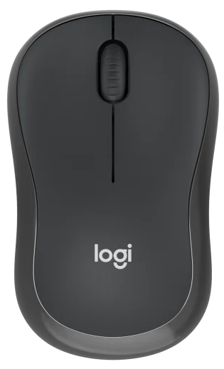
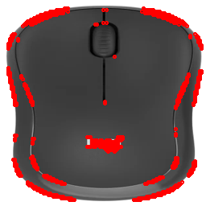

# NumPy Moravec Corner Detector

A computer vision project that implements the **Moravec corner detection algorithm** from scratch using **Python, NumPy, and Pillow**.

This project detects corner-like points in a grayscale image by comparing small image windows with shifted versions of themselves. The detected corner points are then visualized by drawing red circles on the output image.

---

## Overview

This project focuses on understanding how classical computer vision feature detection works at the pixel level.

The Moravec corner detector is one of the early corner detection methods in computer vision. It works by measuring how much a small image window changes when it is shifted in different directions.

If the window changes strongly in multiple directions, the pixel is likely to represent a corner or an important feature point.

This project does not use OpenCV or any built-in corner detection function. Instead, the Moravec algorithm is manually implemented using NumPy arrays, local windows, shifted regions, and Sum of Squared Differences.

---

## Output Preview

### Original Image



### Moravec Corner Detection Output



---

## Features

* Loads an image using Pillow
* Converts the image to grayscale
* Resizes the image for consistent processing
* Converts image pixels into a NumPy array
* Applies the Moravec corner detection method
* Compares local image windows with shifted versions
* Calculates Sum of Squared Differences values
* Builds a corner response map
* Normalizes the response values
* Selects strong corner points using a threshold
* Draws detected corners on the output image
* Saves and displays the final result

---

## Project Structure

```text
numpy-moravec/
│
├── main.py
├── README.md
├── requirements.txt
├── .gitignore
│
├── images/
│   └── mouse.png
│
└── outputs/
    └── moravec_output.png
```

---

## How It Works

The project follows this image processing pipeline:

1. Open the input image.
2. Convert the image to grayscale.
3. Resize the image to a fixed size.
4. Convert the image into a NumPy array.
5. Add padding around the image.
6. Move a small window across the image.
7. Shift the window in multiple directions.
8. Compare the original window with each shifted window.
9. Calculate the Sum of Squared Differences for each shift.
10. Use the minimum SSD value as the Moravec response.
11. Normalize the response map.
12. Apply a threshold to select strong corner points.
13. Draw red circles on the detected corners.
14. Save and display the final output image.

---

## Code Concept

The main idea of the Moravec detector is to compare a small window of pixels with shifted versions of the same window.

The project checks eight possible shift directions:

```python
shifts = [
    (-1, 0), (1, 0),
    (0, -1), (0, 1),
    (-1, -1), (1, 1),
    (-1, 1), (1, -1)
]
```

For each pixel, a small local window is selected:

```python
window = gray[x - offset:x + offset + 1, y - offset:y + offset + 1]
```

Then the same window is compared with shifted regions of the image:

```python
shifted = gray[
    x - offset + dx:x + offset + 1 + dx,
    y - offset + dy:y + offset + 1 + dy
]
```

The difference between the original window and the shifted window is calculated using Sum of Squared Differences:

```python
diff = (window - shifted) ** 2
ssd = np.sum(diff)
```

The minimum SSD value is used as the corner response:

```python
response[x, y] = min(ssd_list)
```

A higher response means the local region changes strongly when shifted, which can indicate a corner or important feature point.

---

## Why This Project Matters

Corner detection is an important concept in computer vision. Corners and feature points can be used in image matching, object tracking, motion analysis, 3D reconstruction, and feature-based recognition.

This project helped me understand how feature detection works before using advanced computer vision libraries.

Instead of relying on a ready-made function, I manually implemented the Moravec method to better understand the relationship between pixel values, local windows, shifted regions, and corner responses.

---

## Installation

Install the required libraries:

```bash
pip install -r requirements.txt
```


After running the script, the output image will be saved in:

```text
outputs/moravec_output.png
```

The program will also print basic response information in the terminal, including:

```text
Detected corners
Response max
Response mean
Response min
```


---

## Learning Outcomes

Through this project, I practiced:

* Working with grayscale images
* Representing images as NumPy arrays
* Understanding local image windows
* Applying padding to image arrays
* Comparing image regions using shifted windows
* Calculating Sum of